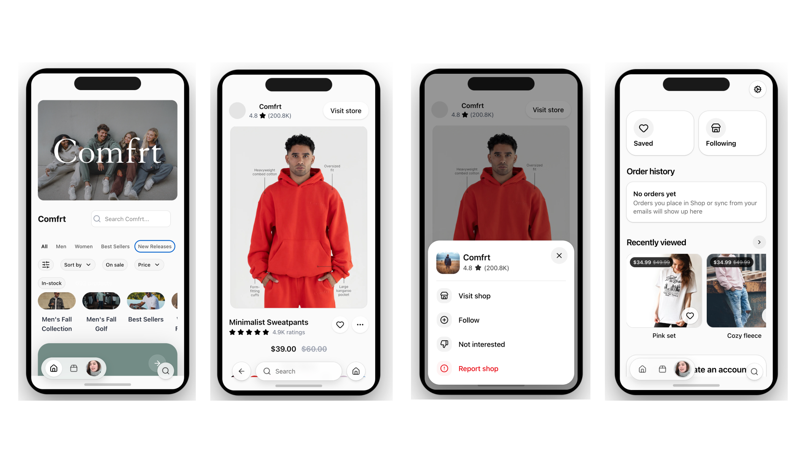

# DigiMall

A modern, mobile-first shopping experience inspired by the world’s leading e-commerce apps.

DigiMall is a **Mall-as-a-Service** frontend — a unified shopping interface pulling products, brands, and experiences into one sleek UI.

---

## 🚀 Vision
Build the "Digital Mall" — where users browse brands, shop curated collections, and enjoy native-app level UX in the browser.

Think **Shop App × Pinterest × Amazon**.

---

## ✨ Features

| Feature | Status |
|--------|--------|
Mobile-first UI (iOS-style) | ✅
Storefront + Collections + PDP components | ✅
Custom Tailwind UI primitives (buttons, pills) | ✅
Component Library (Hero, Carousel, Product Grid) | ✅
Phone frame preview simulator | ✅
Dark mode tokens (OKLCH) | ✅
Scroll/touch adaptive UI | ✅
Store data props system | ✅
Add-to-favorite, filters, sort | 🚧
Shopping cart / checkout | 🛠️ Upcoming
Backend API integration | 🛠️ Upcoming
CMS / Merchant console | 🧪 Research

---

## 🧱 Tech Stack

- **Vite + React + TypeScript**
- **TailwindCSS v4** + custom component layer
- **OKLCH theme tokens** for modern color fidelity
- **Lucide Icons**

Planned integrations:

- **Supabase / Firebase** for user + cart
- **Stripe** for checkout
- **Sanity / Headless CMS** for store data

---

## 🧩 Key Components

| Component | Purpose |
|----------|--------|
`PhoneFrame` | iOS-style device preview wrapper
`StoreControl` | Store rating, filters, sort UI
`FeatureCarousel` | Scrollable hero feature banners
`StoreHero` | Store cover image with logo overlay
`StoreProducts` | Product tile grid UI
`Button` | Tailwind-free button design system

---

## Stying Foundation
UX Enhancements
* Hidden scrollbars (scrollbar-hide)
* iOS momentum scroll (-webkit-overflow-scrolling: touch)
* Micro-animation curves (ease-out, overshoot)
* Components animate like iOS sheets/toasts
---
## 📂 Project Structure

